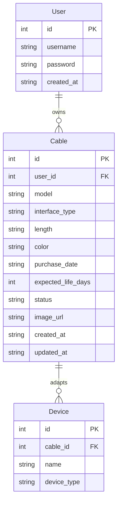

## 1. 架构设计

```mermaid
graph TB
    "Frontend[Vue3 + Element Plus + Vite]" --> "API[Express API Server]"
    "API" --> "Auth[JWT Auth Middleware]"
    "Auth" --> "CableController[充电线 Controller]"
    "Auth" --> "UserController[用户 Controller]"
    "Auth" --> "StatsController[统计 Controller]"
    "CableController" --> "CableService[充电线 Service]"
    "UserController" --> "UserService[用户 Service]"
    "StatsController" --> "StatsService[统计 Service]"
    "CableService" --> "DB[(SQLite Database)]"
    "UserService" --> "DB"
    "StatsService" --> "DB"
    "API" --> "Upload[图片上传 Multer]"
    "Upload" --> "FS[文件系统 uploads/]"
```

## 2. 技术说明

- **前端**：Vue3 + Vite + Element Plus + Tailwind CSS + Vue Router + Pinia
- **初始化工具**：vite-init (vue-express-ts 模板)
- **后端**：Express + TypeScript (ESM)
- **数据库**：SQLite (better-sqlite3)
- **认证**：jsonwebtoken (JWT)
- **图片上传**：multer
- **文件校验**：bcryptjs 密码加密

## 3. 路由定义

| 路由 | 用途 |
|------|------|
| /login | 登录/注册页面 |
| / | 仪表盘首页（统计概览+到期提醒+月度图表） |
| /cables | 充电线管理页（列表+筛选+CRUD） |
| /cables/:id | 充电线详情页 |

## 4. API定义

### 4.1 认证接口

```
POST   /api/auth/register    { username, password } → { token, user }
POST   /api/auth/login       { username, password } → { token, user }
GET    /api/auth/me          Authorization: Bearer <token> → { user }
```

### 4.2 充电线接口

```
GET    /api/cables           ?status=&type=&length=&color=&startDate=&endDate=&page=&pageSize= → { list, total }
GET    /api/cables/:id       → { cable }
POST   /api/cables           { model, interfaceType, devices[], length, color, purchaseDate, expectedLifeDays, image? } → { cable }
PUT    /api/cables/:id       { ...fields } → { cable }
DELETE /api/cables/:id       → { success }
PATCH  /api/cables/:id/status { status } → { cable }
POST   /api/cables/:id/image  FormData { image } → { imageUrl }
```

### 4.3 统计接口

```
GET    /api/stats/overview   → { total, normal, damaged, lost, expiringSoon }
GET    /api/stats/monthly    ?months=6 → [{ month, added, damaged, lost }]
GET    /api/stats/expiring   ?days=30 → [{ cable... }]
```

### 4.4 图片上传接口

```
POST   /api/upload           FormData { file } → { url }
```

## 5. 服务端架构图

```mermaid
graph LR
    "Router[路由层]" --> "Middleware[中间件层]"
    "Middleware" --> "AuthMW[JWT验证]"
    "Middleware" --> "UploadMW[文件上传]"
    "AuthMW" --> "Controller[控制器层]"
    "UploadMW" --> "Controller"
    "Controller" --> "Service[服务层]"
    "Service" --> "Repository[数据访问层]"
    "Repository" --> "SQLite[(SQLite)]"
```

## 6. 数据模型

### 6.1 数据模型定义



### 6.2 数据定义语言

```sql
CREATE TABLE IF NOT EXISTS users (
  id INTEGER PRIMARY KEY AUTOINCREMENT,
  username TEXT NOT NULL UNIQUE,
  password TEXT NOT NULL,
  created_at TEXT NOT NULL DEFAULT (datetime('now'))
);

CREATE TABLE IF NOT EXISTS cables (
  id INTEGER PRIMARY KEY AUTOINCREMENT,
  user_id INTEGER NOT NULL,
  model TEXT NOT NULL,
  interface_type TEXT NOT NULL,
  length TEXT NOT NULL,
  color TEXT NOT NULL DEFAULT '黑色',
  purchase_date TEXT NOT NULL,
  expected_life_days INTEGER NOT NULL DEFAULT 730,
  status TEXT NOT NULL DEFAULT '正常' CHECK(status IN ('正常','损坏','丢失')),
  image_url TEXT,
  created_at TEXT NOT NULL DEFAULT (datetime('now')),
  updated_at TEXT NOT NULL DEFAULT (datetime('now')),
  FOREIGN KEY (user_id) REFERENCES users(id)
);

CREATE TABLE IF NOT EXISTS devices (
  id INTEGER PRIMARY KEY AUTOINCREMENT,
  cable_id INTEGER NOT NULL,
  name TEXT NOT NULL,
  device_type TEXT NOT NULL,
  FOREIGN KEY (cable_id) REFERENCES cables(id) ON DELETE CASCADE
);

CREATE INDEX idx_cables_user_id ON cables(user_id);
CREATE INDEX idx_cables_status ON cables(status);
CREATE INDEX idx_cables_interface_type ON cables(interface_type);
CREATE INDEX idx_cables_purchase_date ON cables(purchase_date);
CREATE INDEX idx_devices_cable_id ON devices(cable_id);
```
